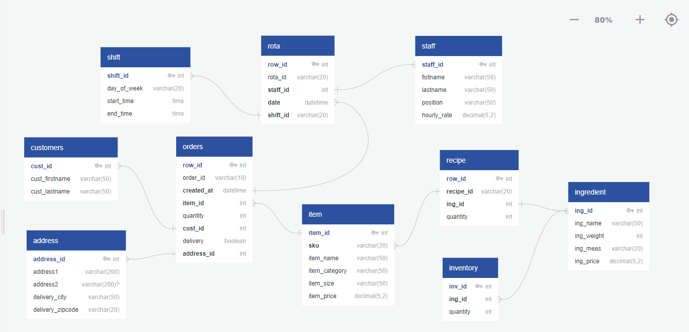

# Pizzeria de Ben

## Design a tailor-made pizza and order it online.

### Main Areas of Focus

- [ ] Orders
- [ ] Stocks Control
- [ ] Staff Management

### Normalized Data and defining relationships


### Client requirements for the table Orders

- Item name
- item price
- Quantity
- Customer Name
- Delivery Address

### Ours requirements for the table Orders

- Row ID
- Order ID
- Item ID
- Item category
- Item size
- Item price
- Quantity
- Customer First Name
- Customer Last Name
- Delivery Address 1
- Delivery Address 2
- Delivery city
- Delivery zip code


## We are using Quick DBD


  

```sql
orders
- 
row_id int pk
order_id varchar(10)
created_at datetime
item_id int FK >- item.item_id
quantity int
cust_id int fk
delivery boolean
address_id int fk


customers
-
cust_id int pk FK >- orders.cust_id
cust_firstname varchar(50)
cust_lastname varchar(50)

address
-
address_id int pk FK >- orders.address_id
address1 varchar(200)
address2 varchar(200) NULL
delivery_city varchar(50)
delivery_zipcode varchar(20)

item
-
item_id int pk
sku varchar(20) FK >- recipe.recipe_id
item_name varchar(50)
item_category varchar(50)
item_size varchar(50)
item_price decimal(5,2)

ingredient
-
ing_id int pk FK >- recipe.ing_id
ing_name varchar(50)
ing_weight int
ing_meas varchar(20)
ing_price decimal(5,2)

recipe
-
row_id int pk
recipe_id varchar(20) fk
ing_id int fk
quantity int

inventory
-
inv_id int pk
ing_id int FK >- ingredient.ing_id
quantity int

staff
-
staff_id int pk
fistname varchar(50)
lastname varchar(50)
position varchar(50)
hourly_rate decimal(5,2)

rota
-
row_id int pk
rota_id varchar(20)
data datetime
shift_id varchar(20)
staff_id int fk

shift
-
shift_id int pk
day_of_week varchar(20)
start_time time
end_time time


```